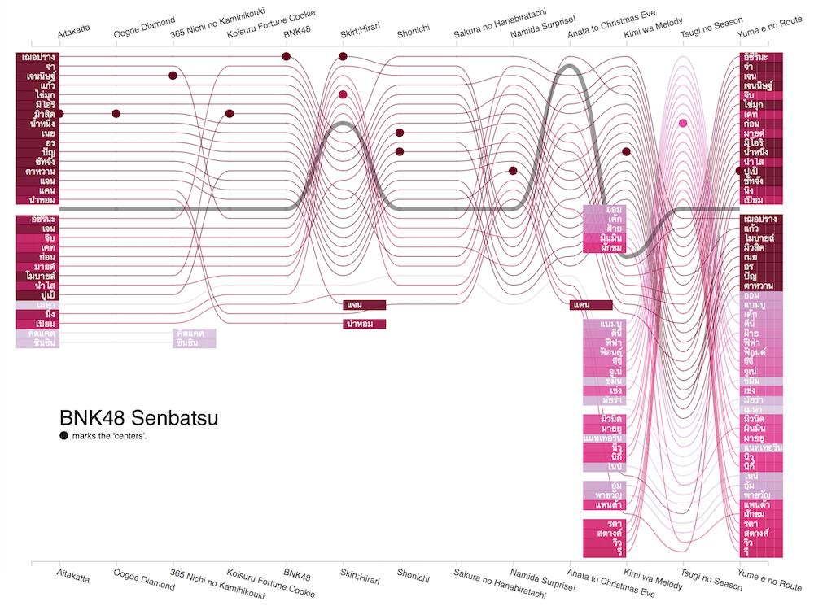

# BNK48 Senbatsu Bump Chart

Bump chart of BNK48 "senbatsu" members. The sister group of AKB48 in Thailand has about 30-50 members in total. Each single features only around 16 members, those above the thick gray line. The rest will be backups. The "centers" (usually 1-2 members or none at all) of each single are highlighted in circles. The memebrs who appear in a lot of singles are in darker colors. See the live version at http://puripant.ruchikachorn.com/BNK-bump/ or see the screenshot below.

